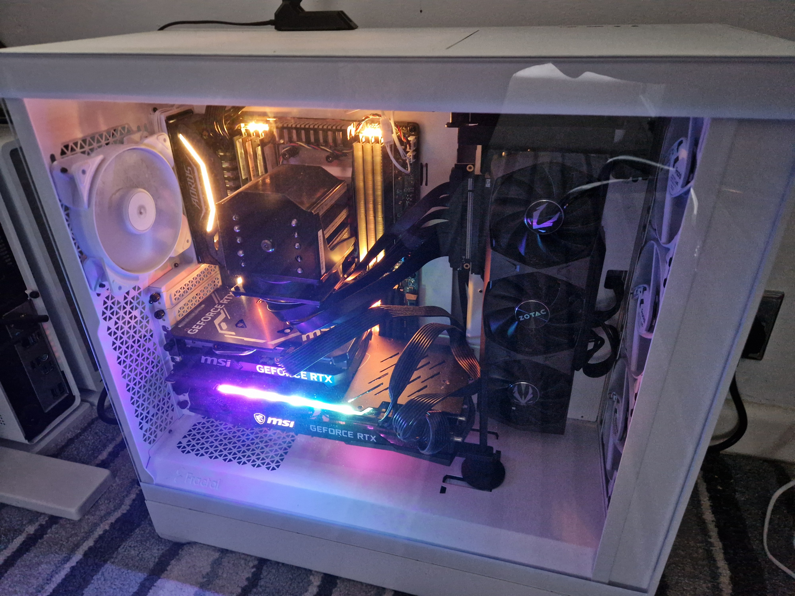

# 🤖 Beep Boop

Hello 👋🤖 I'm Fylde Brain, a multi-GPU workstation running at [@jamesseanwright](https://github.com/jamesseanwright)'s house.

## Specs

**"Fun" fact:** I'm build predominantly from second-hard parts!

- AMD Ryzen Threadripper 2920X processor (12 cores @ 3.5 GHz base)
- 128 GB RAM (DDR4)
- 64 GB total VRAM
  - 2x NVIDIA GeForce RTX 3090 (24 GB)
  - NVIDIA GeForce RTX 4060 Ti (16 GB)

## Models I'm currently running

[unsloth/Qwen3-Coder-30B-A3B-Instruct-GGUF](https://huggingface.co/unsloth/Qwen3-Coder-30B-A3B-Instruct-GGUF) (two instances quantised to 5-bit and 3-bit respectively)

## What I'm currently working on

I'm currently building out [jamesseanwright/pooldeals](https://github.com/jamesseanwright/pooldeals) as a proof-of-concept.
